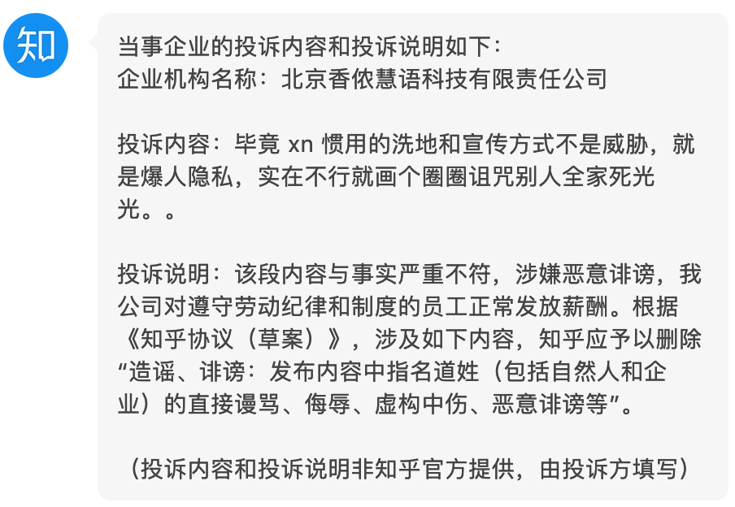

**shannon.ai-breaking-news**

香侬科技知乎爆料备份

公司简称：香侬科技

公司全称：北京香侬慧语科技有限责任公司

统一社会信用代码：91110105MA0197F44F

法定代表人：李纪为

CEO：李纪为

### 香侬科技恶行概要：

- 公积金和社保不按照实际工资交纳，都是最低标准。
- 试用期期间（6个月），工资打八折，卡着试用期要结束的前一周，辞退员工（不是员工能力不能胜任）。用最低的成本压榨尽可能长的时间。
- 996 是日常操作，不但往后弹，还往前弹。加班费就更别想了。在员工手册中写：”大家一般工作时间都在12小时以上“，鼓励大家主动加班。上班打卡，下班不打卡。防止留下强制加班的证据。
- 中秋节假期强迫员工加班，还没有加班费，ceo扬言：“我是老板，你们凭什么不加班。不加班就滚蛋“
- 2020年初大量辞退员工，不给发年终奖，还用背调威胁诋毁员工，以少发补偿。
- 洗地的时候，咒骂爆料员工全家惨死。
- 公司发生性骚扰事件，受害方离职，侵犯方反而被重用。
- 期权分四年成熟，每年成熟比例是10%，20%，30%，40%。
- 复制客户的产品自己偷卖，抄袭客户的 idea。

### 知乎删帖事件：

数十名员工（公司总人数110人左右）在知乎上发起了声讨香侬科技和李纪为的行动。2020年5月20日，香侬科技以”商业侵权“，”恶意诽谤“为由，向知乎恶意投诉爆料贴。知乎删除数十个爆料贴。投诉内容如下图所示：

爆料贴中爆料内容都是事实。香侬科技妄图利用中国强调和谐，严格管控互联网的特点来屏蔽正义、真实的声音。知乎删帖之后，引起相关员工强烈不满。为了避免其他人被坑，特将从各处搜集到的爆料贴内容备份至此处，供广大网友品阅。遗憾的是，有些帖子已经永久丢失了，但庆幸的是，留下的也足以还原事情真相。