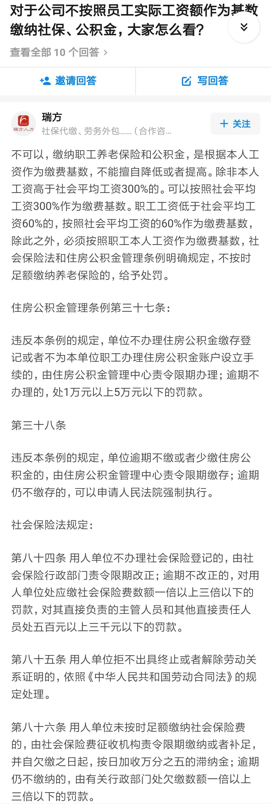
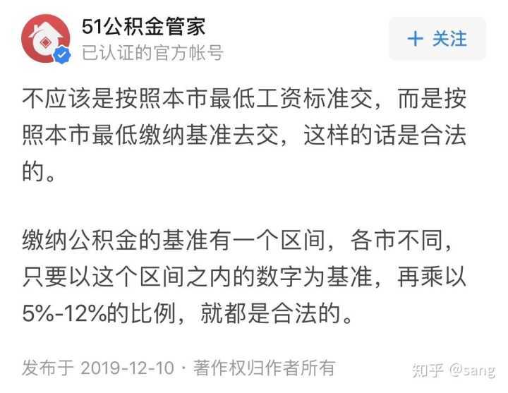
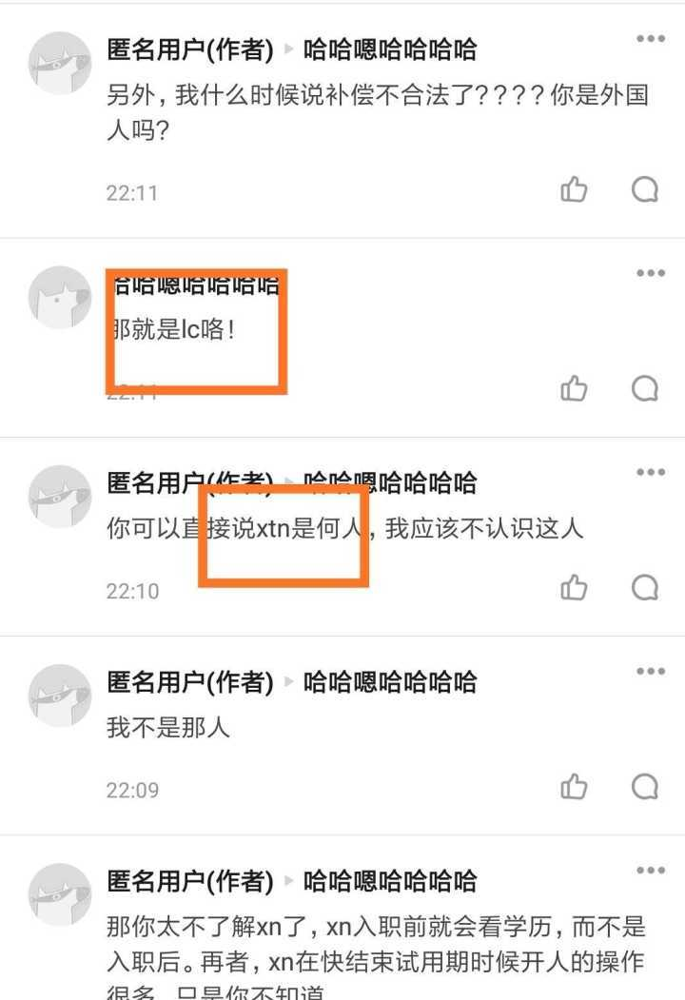
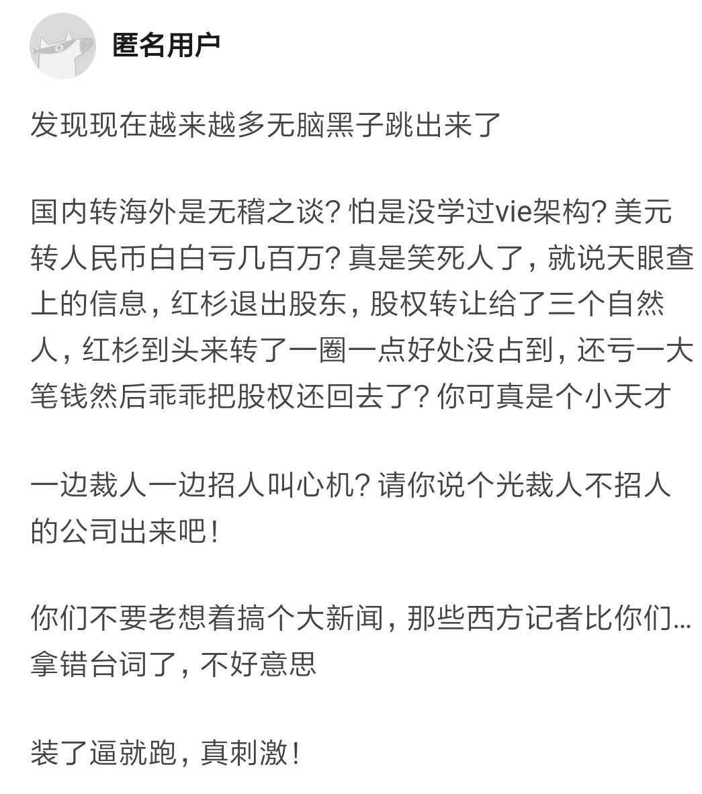
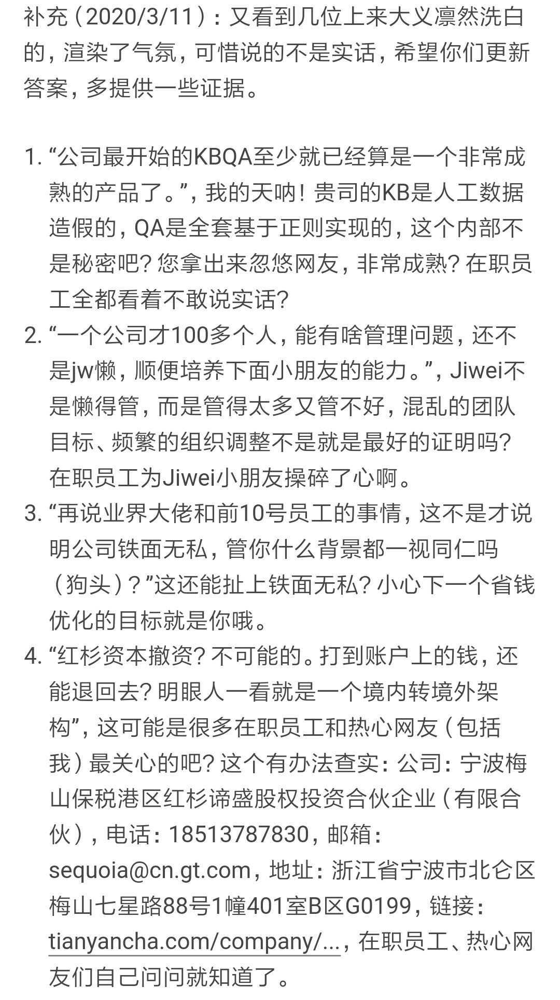
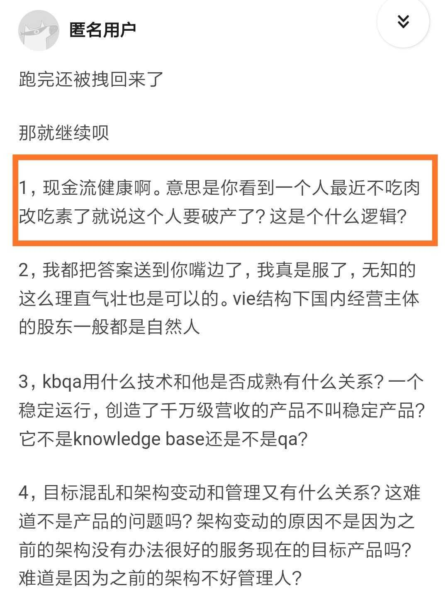
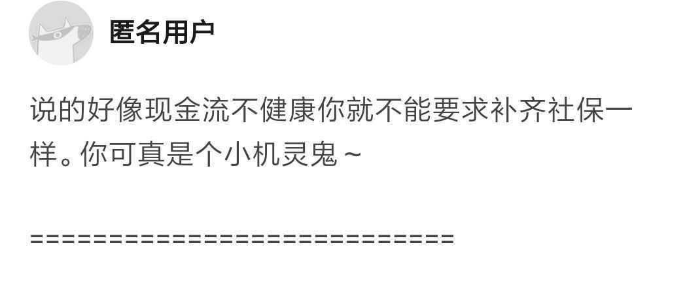
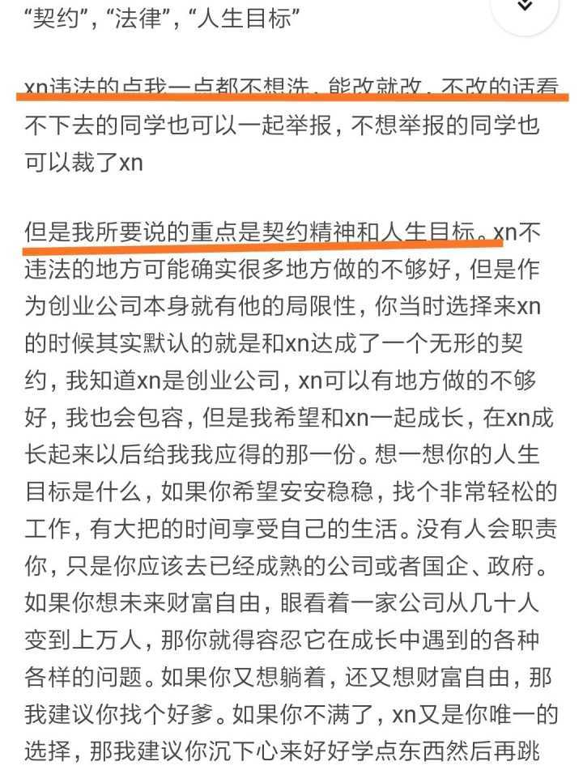
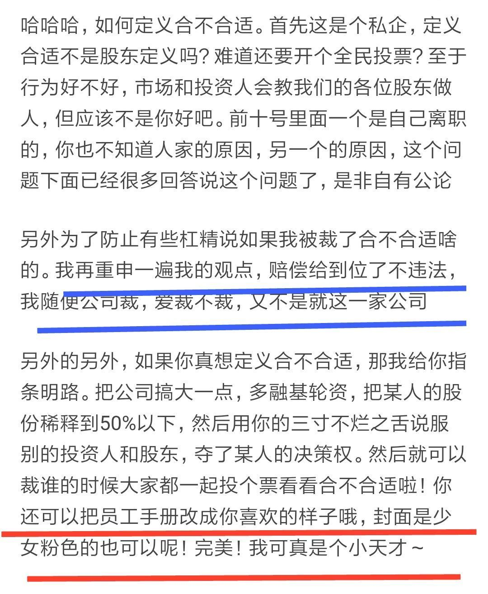
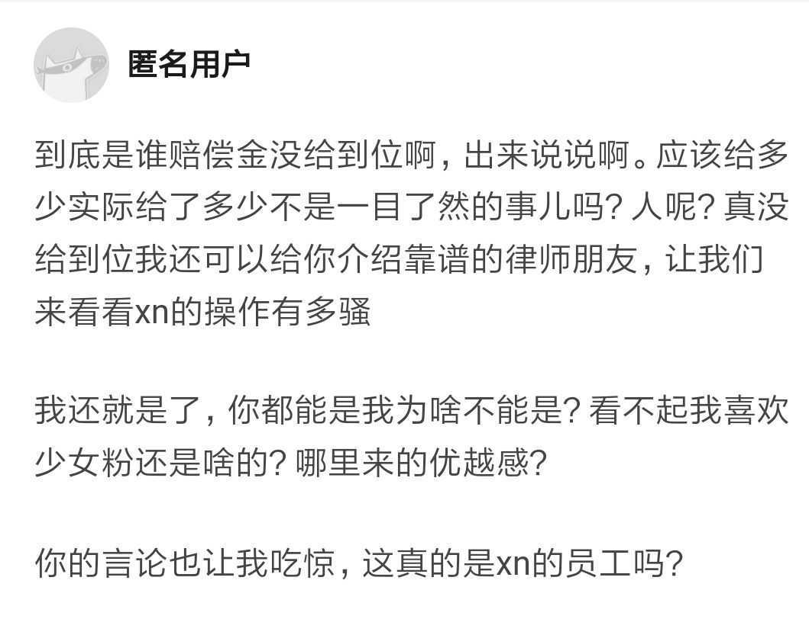

原文链接（可能被删帖）：https://www.zhihu.com/question/298711672/answer/1239354487

以下是原文：

--------------------------

（一）

什么也不说了，就发一张图。

———————————————————————————

（二）

有人说，按照最低缴纳不属于违法（详细内容见我这条评论，疯狂吃瓜的回复）

既然如此，我在贴一个图。

——————————————————————————

（三）

@sang  说的这个是对的，不过这是公积金，好的公司都会给员工多缴纳公积金，当然啦，垃圾的公司巴不得不缴纳。

然而社保是必须按照工资缴纳，当然有个上限，也就是不得高于当地最低工资的300%。请各位吃瓜群众了解清楚。不了解的私信我。

另外，如果xn还是这个态度，企图混淆是非，我会集结所有被裁同学一起去海淀区社保中心要求xn补齐过去所有的社保，按照国家要求缴纳！看看我们的要求是不是不合法！

———————————————————————————

（四）

sang引用了“资本永不眠”这句话，说这句话的哥们应该是b站的巫师财经，这哥们因为涉嫌抄袭已经挺久没有作品了，所以人品更重要。

不要寄希望资本的影响力大于人品！

再者，@sang，你提了公积金的缴纳比例，这没问题。而我现在说的社保，你不要企图用公积金来混淆视听，xn社保是怎么缴纳的？如果不是按照全额缴纳，那么就是偷税漏税。

第三你提了很多在疫情裁员或者降薪的公司，可是这和xn有什么关系？xn的员工是可以对标思科这样公司的员工，那么思科是怎么做的？在退一步说，你列举的公司中有人工智能公司吗？有nlp公司吗？你这分明是偷换概念，你怎么不把xn和饭店服务员比呢？？？

——————————————————————————

（五）

刚刚xn的人不断猜测我是谁，我想应该不是邀请我吃饭吧。呵呵～当然啦，此人可以说自己不是xn的人。

———————————————————————————

（六）

其实想想：资本永不眠，这句话说的很对，资本是逐利的，所以当资本发现不能为其增值的时候就会止损。

所以，大家知道为什么红杉撤资了吧。

———————————————————————————

（七）

那么，请这位匿名用户回答一下：

1.香侬的现金流是不是还很健康？

2.为什么红杉的人退出股东呢？

别装了逼就跑哦～群众在看！！！

———————————————————————————

（八）

本来不想和这位匿名用户废话的，因为这人才是无脑白！！！根据他之前的回答，有热心群众回复如下，这位匿名用户出来解释一下啊。

———————————————————————————（九）

现在这个问题已经有10万多次的浏览，我想这里面包含xn的在职员工、离职员工以及这次疫情中被优化的员工、nlp同行、北大校友，更重要的是可能还有很多潜在xn产品用户和vc。

所以希望强行洗白的人斟酌语言，不要让人感觉xn管理层就这个水平，丢北大的脸。当然也有可能你们对危机公关真的就这个水平，我也能理解，所以红杉已经退出了。

———————————————————————————

（十）

太好了，既然现金流是健康的，那么我就要求公司补齐社保，个人部分我自行承担。本来我都不准备要了！ 

[@李纪为](http://www.zhihu.com/people/5e056432a4ff5e6120a5dc0c5d50afca)

 @sang等。

———————————————————————————

（十一）

在xn科技的未缴纳全额社保的同学们，你们可以要求公司缴纳全额社保。离职的同学们也可以要求公司补齐社保，但是个人部分则需要自己承担。

社保现在由于大家都年轻，所以无所谓，以后老了优势就体现出来。

公司如果不给办理，直接去海淀区社保局举报。去银行把工资流水打出来，再带上劳动合同即可。

国家社保现在也需要钱！

———————————————————————————

（十二）

坦率讲，本来我真的没打算要，因为我也看出来xn内部资金有点问题。不过既然你说了xn内部现金流很充足，那么我也就给国家社保做点贡献吧。

——————————————————————————

（十三）

首先，你也意识到并承认了xn有违法的行为，这很好啊，说明你还是个三观正的人。

其次，你又提到了契约精神，那么请问三观正又有契约精神的你，xn违法我们应该怎么办？

为了回答你的问题，浪费了许多时间，今晚我要加班了，我也要有契约精神。

———————————————————————————

（十四）

说3点：

1、蓝线：之所以有那么多人评论，就是因为补偿不合法。我已经@李纪为了，坐等回复。

2、红线：你的言论让我吃惊，这真的是xn的员工吗？

3、之所以有那么多出来喷xn，就是因为你这种人太多了，大大方方认个错有什么？

我一直都认为ljw用xn做公司名这是个绝妙的主意，承上启下，继往开来！说难听点，就算有一天xn黄了，倒下去也是一座山。现在看来。。。。。。

———————————————————————————

（十五）

1.很多人都没有补偿到位，而且社保也有问题。你不能代表ljw，我犯不着告诉你。我已经@ljw，坐等他的回复，除非你就是ljw。

2.你在前一个评论中，企图给那位同学贴一个粉色少女的标签，这是什么居心，所有看到的人心里都会有杆秤。

———————————————————————————

（十六）

之前回复里面@ljw，重申了xn科技没有全额缴纳社保，而这是违法行为。到目前为止他还没有正面回复。

之前有同学说ljw北大期间举报了ghw“性骚扰”  女同学，而该女生是ljw心上人且该女生和ghw是两情相悦。

结合xn的一系列暴力裁员，压榨员工（还有很多北大学弟学妹），偷税漏税（不足额缴纳社保）等，可以得到的结论只有一个：ljw非常卑鄙！

初创公司核心团队人员的学历、经历和魅力对于公司的发展方向等至关重要。看看xn除了高管团队学历还可以（其实也没几个博士，名校毕业倒不少，但也有很多都是实习生），经历和魅力基本上没什么亮点。而ljw格局和人品就呵呵了。