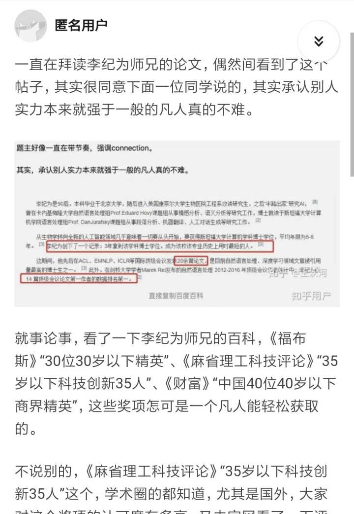
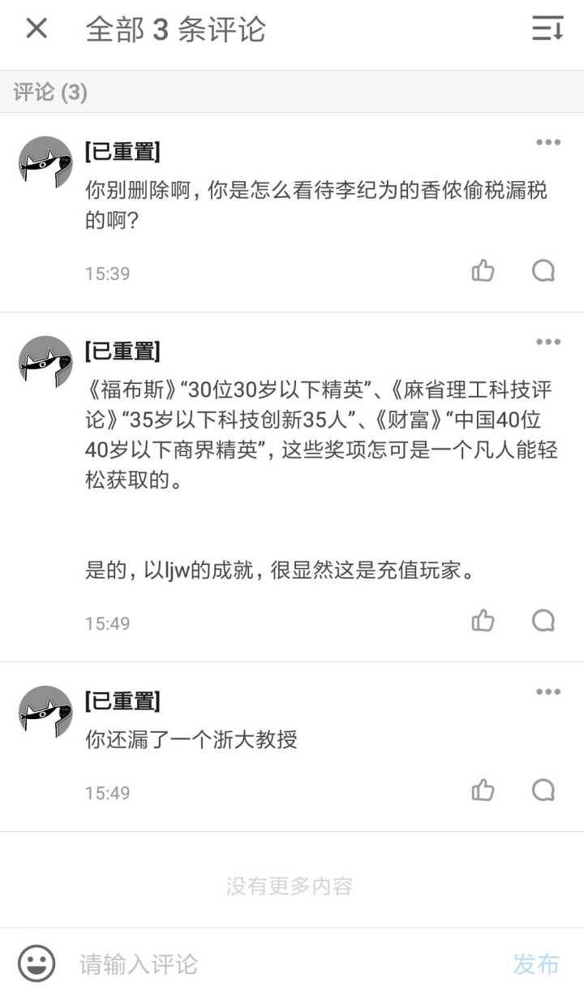

帖子1：

原文链接（可能被删帖）：https://www.zhihu.com/question/299963736/answer/1207621443

以下是原文：

----------------

@[已重置] https://www.zhihu.com/question/299963736/answer/1204585922 这个回答很明显是xn的公关行为，伪装成吃瓜群众，找人点赞的事儿他们干了也不是一回两回了。没必要跟这种人争论，大多数人总是倾向于相信自己愿意相信的，出名的人，屎都是香的。

[心理学上如何解释「脑残粉」现象？](https://www.zhihu.com/question/20590363)

-------------

帖子2：

原文链接（可能被删帖）：已丢失

高票回答一直在避重就轻，并删除他人在评论区的回复。至于李纪为也一直不回复。呵呵～

  

[@李纪为](https://www.zhihu.com/people/5e056432a4ff5e6120a5dc0c5d50afca) [@香侬科技](https://www.zhihu.com/people/ccc0dcb6b1671b66af8ba4a870e06f7e)

请问一下，不按照工资标准缴纳全额五险一金这个是不是偷税漏税啊？请问偷税漏税是什么行为啊？

* * *

[@李纪为](https://www.zhihu.com/people/5e056432a4ff5e6120a5dc0c5d50afca) ，作为一个高知识分子且自我标榜实名制举报北大性骚扰的正义人士。请问你给你的香侬科技员工没有按照全额缴纳社保，你如何解释？？？

这种行为可以被定义为偷税漏税，听说你还很爱国，把国旗放在微信头像上。

* * *

996加班，已背调做威胁等这些或许你会说有人黑你。产品乱糟糟，公司经常性调整一会2b一会2c或许你会说这是你的战略。可以，我可以接受。

可是你不按照工资足额缴纳社保、裁员不给和少给补偿，这个你怎么解释呢？？？

这总不是大家黑你吧。