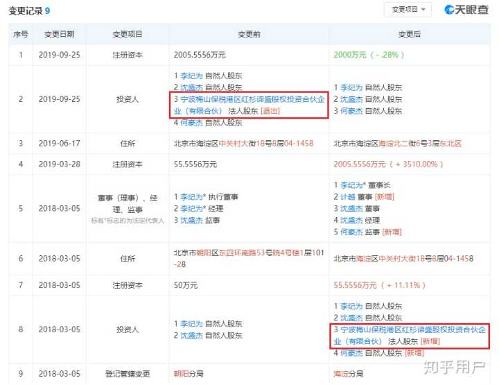

原文已被删帖，原始链接丢失 :-(

-----------

有一个做技术的朋友从香侬科技离职了，得到的消息：

1.  红杉资本应该已经从香侬科技撤资了（可以参考天眼查、企查查，跟投资方打听）；
2.  Jiwei表面上吹牛时有亲和力，其实是腹黑男，因为缺钱，已经清理了一批员工，包括公司前十号创始人等等（可以跟内部人员打听）；
3.  公司算法、论文底子厚，但是工程水平很菜，更致命的是管理混乱，创立两年没啥成型像样的产品（众所周知）。

* * *

补充（2020/3/9）：今天回到帖子看了下，很多回答进行了详细的说明，比如工作时间、薪资待遇、生活趣闻、团队管理、架构调整等等，这些都是真实的；大家都知道“张强”是谁，加上来洗白的几位，想说几句：

1.  员工关怀应该给予每一位同事，表现好的应该给予额外奖励，然而贵司根本没有加班费、特殊时期双倍工资也是在欺骗员工？然后你们自己招的人居然说别人是“废物”、“垃圾”？那面试官是啥呢？
2.  公司的大佬纷纷走了，你们反倒说别人能力不行、搞事情？难道忘了他们给贵司从零到一打下的框架和基础吗？留下来的这么强，结果做不出啥东西来？
3.  有人说贵司是研究院、发了不少论文，这话抬举了，少数人负责灌水（参考论文署名前几位），大部分实习生还是干活，想拿推荐信的不要太乐观，最好去大厂研究团队；至于贵司论文质量，就拿Glyce来说，参考“如何评价**香侬科技**提出的基于中文字型的深度学习模型 Glyce？”[https://www.zhihu.com/question/310708904](https://www.zhihu.com/question/310708904)
4.  贵司内部还对期权抱有幻想的人，祝你们心想事成。

* * *

补充（2020/3/10）：看到一位说“瓜农们非法聚集种瓜”的，您跟“客观公正”差得太远了。。。请问被公司坑的员工没有发言权？相关知情人员没有发言权？大家说的哪一句话非法了？非法操作的到底是那个谁呢？对于你列出的几条，说明几点：

1.  公司的融资开销没规划好、组织结构频繁调整等等，是贵司决策层的锅，结果需要通过一系列强硬的神操作让下面员工来背锅？
2.  公司优化员工是从2019年9月份开始的，这个时间结点发生了啥参考截图，所以那时贵司掐指一算知道新冠肺炎疫情要来了？而当前疫情只是加剧了优化流程，您不能让“疫情”来背锅呀，这招太损了。
3.  贵司跟大厂差距大着呢，所以先考虑跟其它创业公司比比，据我的消息，别的NLP创业公司并不是996，正常一周五天班呐？然后您来一句多数员工“并不具备同舟共济得条件与意识”？贵司这一波波神操作还要别人同舟共济？
4.  张文宏医生说过“不能欺负老实人”，请贵司对员工高抬贵手，也不要觉得知乎网友好糊弄，有时间读一读《逻辑学导论》。

* * *

补充（2020/3/11）：又看到几位上来大义凛然洗白的，渲染了气氛，可惜说的不是实话，希望你们更新答案，多提供一些证据。

1.  “公司最开始的KBQA至少就已经算是一个非常成熟的产品了。”，我的天呐！贵司的KB是人工数据造假的，QA是全套基于正则实现的，这个内部不是秘密吧？您拿出来忽悠网友，非常成熟？在职员工全都看着不敢说实话？
2.  “一个公司才100多个人，能有啥管理问题，还不是jw懒，顺便培养下面小朋友的能力。”，Jiwei不是懒得管，而是管得太多又管不好，混乱的团队目标、频繁的组织调整不是就是最好的证明吗？在职员工为Jiwei小朋友操碎了心啊。
3.  “再说业界大佬和前10号员工的事情，这不是才说明公司铁面无私，管你什么背景都一视同仁吗（狗头）？”这还能扯上铁面无私？小心下一个省钱优化的目标就是你哦。
4.  “红杉资本撤资？不可能的。打到账户上的钱，还能退回去？明眼人一看就是一个境内转境外架构”，这可能是很多在职员工和热心网友（包括我）最关心的吧？这个有办法查实：公司：宁波梅山保税港区红杉谛盛股权投资合伙企业（有限合伙），电话：18513787830，邮箱：sequoia@cn.gt.com，地址：浙江省宁波市北仑区梅山七星路88号1幢401室B区G0199，链接：[https://www.tianyancha.com/company/3139018270](https://link.zhihu.com/?target=https%3A//www.tianyancha.com/company/3139018270)，在职员工、热心网友们自己问问就知道了。

引用热心网友回答（2020/2/29）：事实胜于雄辩，不吹不黑，过个一年半年，咱再来看看贵司有什么拿得出手的成果。

* * *

补充（2020/3/19）：凌晨看到最新动态，有不少新的回答，读完之后唏嘘不已。

1.  先说明一点，**香侬清理的前十号员工不止一个**，我才知道原来那位备受关注的基础架构组组长恰好是第十号员工，那么请问香侬第六号员工的故事，也是飞鸟尽、良弓藏了么？
2.  在职员工、离职员工、知情网友都在关注香侬动态，所以领导的态度是否诚恳、接下去的动作是否有效非常关键，可是很多人发现了你们还在和稀泥？扣用词细节、找表达漏洞、转移视线、注册小号协助洗白等等。发现一个强盗逻辑：香侬知道事情闹大了、瞒不住了，“希望各位吃瓜吃饱了就散了吧不要再闹了”，然后缺钱优化员工的时候“一刻也停不下来”？
3.  继续说明一点：香侬不是因为疫情而优化员工，这只是个催化剂，加剧了整个处理流程、而且**疫情被香侬当成是一个可以和其它公司裁员归为一类的借口**！真正的原因是因为**红衫退出股东**，实在太缺钱了，所以需要员工来买单背锅。红衫的事儿不止三个合伙人知道，近期被扒的CTO、公司几位负责人也知道（Jiwei公布的版本），跟红衫有联系的人可以打听到原滋原味的版本，天下没有不透风的墙嘛。
4.  不用去猜我的朋友是谁，猜错就误伤了，一山还有一山高，大佬的标准并不统一。通过香侬朋友和爆料回答了解到了基础架构组组长的情况，想说几句：你是个有能力的真汉子，香侬配不上你！你手上有爆料稿和录音为证，不要担心香侬调查算计威胁你！

