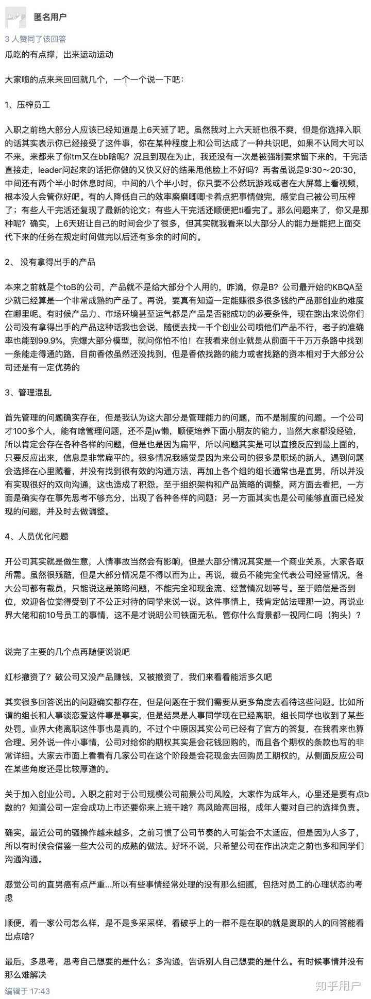
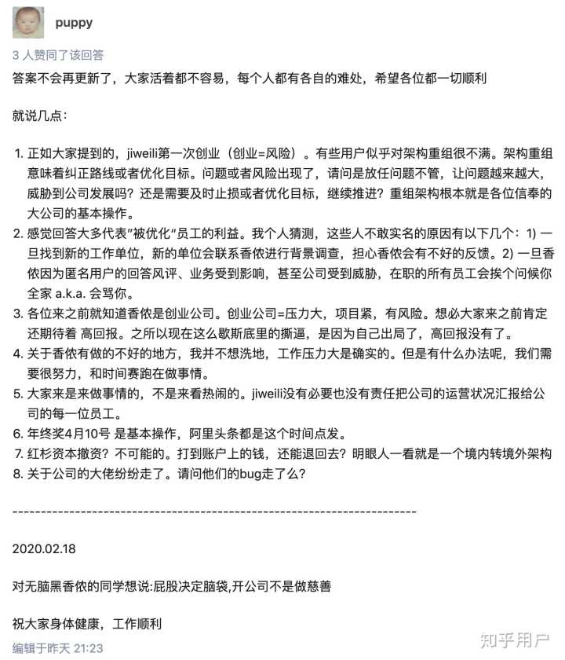

原文链接（可能被删帖）：https://www.zhihu.com/question/298711672/answer/1072239155

以下是原文：

----------------

资产阶级阵营已经开始恐慌了，开始投诉帖子，说帖子有辱骂/歧视成分，试图通过知乎的力量来屏蔽正义的声音！

* * *

理中客们一个个浮出水面。我来解说一下。

> 马克思主义者认为，“资产阶级”是压迫者和剥削者；而那些为了个人利益，在[阶级斗争](https://link.zhihu.com/?target=https%3A//zh.wikipedia.org/wiki/%25E9%2598%25B6%25E7%25BA%25A7%25E6%2596%2597%25E4%25BA%2589)过程中（[无产阶级革命](https://link.zhihu.com/?target=https%3A//zh.wikipedia.org/wiki/%25E6%2597%25A0%25E4%25BA%25A7%25E9%2598%25B6%25E7%25BA%25A7%25E9%259D%25A9%25E5%2591%25BD%25E8%25B7%25AF%25E7%25BA%25BF)，[罢工](https://link.zhihu.com/?target=https%3A//zh.wikipedia.org/wiki/%25E7%25BD%25B7%25E5%25B7%25A5)等）收受资产阶级的好处，在精神上或者行为上支持资产阶级，从而出卖了无产阶级利益的无产者则通常会被称为“[工贼](https://link.zhihu.com/?target=https%3A//zh.wikipedia.org/wiki/%25E5%25B7%25A5%25E8%25B3%258A)”或者“资产阶级的走狗”。引自[维基百科-资产阶级](https://link.zhihu.com/?target=https%3A//zh.wikipedia.org/wiki/%25E8%25B3%2587%25E7%2594%25A2%25E9%259A%258E%25E7%25B4%259A)

香侬正在发生的事情，本质上是正是资产阶级和无产阶级之间的斗争。下面两个回答就来自资本主义阵营中的无产阶级。（截图以备份）

* * *

对他们的这些说辞，摘录一些片段做下解说：

> 1、压榨员工  
> 入职之前绝大部分人应该已经知道是上6天班了吧。虽然我对上六天班也很不爽，但是你选择入职的话其实表示你已经接受了这件事，你在某种程度上和公司达成了一种共识吧，如果不认同大可以不来，来都来了你tm又在bb啥呢？  
> 各位来之前就知道香侬是创业公司。创业公司=压力大，项目紧，有风险。

确实，入职之前绝大部分人应该已经知道是上6天班了。但是大家没有想到的是，xn竟然能垃圾到这种地步。996只不过是压垮骆驼的其中一根稻草而已。大家喷的那些点，只不过是冰山一角，有太多细微的事情单独看感觉没太大问题，加起来就让人感觉垃圾至极。难道员工说公司垃圾，难道就不能喷已知的垃圾事情么？举个例子，现在很多华人对美国趋之若鹜，认为美国是自由的天堂，纷纷移民美国，但是我们知道美国的房产税是比较重的。如果有一天，美国总统nc，发起了一场\*\*大革命，限制华裔出门要限行，要被时时监控，只能上不好的学校，只能吃坏掉的粮食等等。华裔觉得很不爽，就会奋起反抗，诉说美国的N大罪状，其中就包括房产税。难道你能说：“你们来之前知道美国房产税比较重了，还bb啥？”美国人说出这种话，尚可以理解，如果美国政府里的华裔官员也这么说，那这些人就是彻头彻尾的“资产阶级的走狗”了。

**我抽出 xn 压垮员工万千稻草中的一根给大家看。xn 试用期工资只能拿80%左右。起初xn试用期是三个月，试用期工资和正式工资一样，后来改成六个月，部分人（具体比例有多少不太清楚）试用期工资只能拿正式工资的 80% 左右。没听说过哪个靠谱的互联网公司如此操作。这种操作实在是太心机了，可以让公司在需要人力的时候，用尽可能低的价格用工尽可能长的时间，不需要人力了就让员工试用期不过。真是个好方法，关键还tm不违法。有多少能力不错的人在试用期结束的那一周被优化！大多数人都认为"试用期工资只能拿80%"情有可原，毕竟自己没有证明自己的能力。让人痛心的地方在于，xn 通过法律，堂而皇之的压榨他们的劳动力，还最终剥夺了他们的希望。这种做法，还让员工不骂你？天理不容啊。这样的小事情真的太多了，大家都称为 xn 骚操作。正所谓“得道多助，失道寡助”，对ljw来说，第一个“道”是名气，第二个“道”是做人。**

> 再者虽说是9:30～20:30，中间还有两个半小时休息时间，中间的八个半小时，你只要不公然玩游戏或者在大屏幕上看视频，根本没人会管你好吧。

休息时间不是公司规定的，公司规定的下午开工时间是13:30。但是员工中午的休息时间逐渐延长，开工时间推迟到了2点多。这是一个自发的行为，不是公司规定，这是有本质区别的。员工之所以会这样，是因为觉得自己做的事没什么意义，多做一小时，少做一小时，自己都没什么收获，与其在资本家的督促下不断赶工，还不如多休息一下。所以只要保证工作时间不违背良心即可。

> 有的人降低自己的效率磨磨唧唧卡着点把事情做完，感觉自己被公司压榨了；有些人干完活还复现了最新的论文；有些人干完活还顺便把ti看完了。那么问题来了，你又是那种呢？  
> 随便去找一千个创业公司喷他们产品不行，老子的准确率也能到99.9%，完爆大部分模型，就问你怕不怕！

这两句话是重点，充分证明了你是发 paper 的那拨人，不像其他员工一样，每天做的都是乱七八糟的没有意义的脏活累活。其他员工都觉得你们很幸福，活不多，催的不紧，还tm能名利双收。

> 在我看来创业就是从前面千千万万条路中找到一条能走得通的路，目前香侬虽然还没找到，但是香侬找路的能力或者找路的资本相对于大部分公司还是有一定优势的

"在你看来", 你已经俨然以资本家的身份自居了。从”从前面千千万万条路中找到一条能走得通的路“，所以普通员工应该给你们做牛做马，不断踩坑摸索，你们站在岸上拿着皮鞭吆喝还嫌慢，成功了，你们反而夺走了最多的利益。公司整天搞一些乱七八糟的项目，考察过么，调研过么？普通员工就应该充当你们实验的炮灰么？搞的所有人看起来都很忙，每个项目都催得很紧，但是除了收获到身体和内心的疲惫，能力上毫无长进。

> 首先管理的问题确实存在，但是我认为这大部分是管理能力的问题，而不是制度的问题。

**xn面临的问题不是管理能力的问题，也不是制度的问题，而是道德的问题。**

> 一个公司才100多个人，能有啥管理问题，还不是jw懒，顺便培养下面小朋友的能力。当然大家都没经验，所以肯定会存在各种各样的问题，但是也是因为扁平，所以问题其实是可以直接反应到最上面的，只要反应出来，信息是非常扁平的。

这纯粹就是瞎扯淡了，说的也太冠冕堂皇了。jw 想把权利紧紧攥在手里，他也没有能力培养其他人的能力。”下面小朋友“可以看出你在jw面前屈膝的媚态，你可以屈膝，但不代表所有人都会屈膝。不要试图把“出现各种各样的问题”的原因归结到经验问题上，这仍然是道德问题。公司并不扁平，100多人的团队，分成了5级（CEO-其他合伙人-CTO-小组leader-普通员工），从来没听说过”下面小朋友“能直接给”最上面“的CEO反应问题的，也从来没听说过”最上面“的CEO愿听”下面小朋友“的声音。

> 至于组织架构和产品策略的调整，两方面去看把，一方面是确实存在事先思考不够充分，出现了各种各样的问题；另一方面其实也是公司能够直面已经发现的问题，并及时去做调整。

典型的理中客。xn是你家自留地，你想咋地就咋地。

> 开公司其实就是做生意，人情事故当然会有影响，但是大部分情况其实是一个商业关系，大家各取所需。

理中客+冠冕堂皇。你说的”各取所需“给人一种互惠互利，共赢的感觉，其实是单向压榨。

> 至于赔偿是否到位，欢迎各位觉得受到了不公正对待的同学来说一说。这件事情上，我肯定站法理那一边。

有些员工在试用期将要结束的时候（两三天），xn突然跟他们说让他们走人，给0.5个月的补偿，但是他们并不是因为能力不足。违法么？不违法！一个希望的破灭比没有希望更加令人绝望。有着什么样内心的人才能做出这种事。这就是xn。

> 再说业界大佬和前10号员工的事情，这不是才说明公司铁面无私，管你什么背景都一视同仁吗？

你t娘的真是个天才！这话都说得出口。

> 答案不会再更新了，大家活着都不容易，每个人都有各自的难处，希望各位都一切顺利

老子高高在上，没时间跟”下面的小朋友“bb。我是体恤民情的大佬，我知道大家有难处，你们也要理解，我做大佬也不容易。

> jiweili第一次创业。有些用户似乎对架构重组很不满。

继续把公司的问题归结于jw经验不足上。

> 架构重组意味着纠正路线或者优化目标。问题或者风险出现了，请问是放任问题不管，让问题越来越大，威胁到公司发展吗？还是需要及时止损或者优化目标，继续推进？

老板掌控这全局，需要全局优化，你们这些炮灰就别瞎bb了，为了公司继续活下去，止损你们活该。我是老板，我想怎么优化就怎么优化。

> 我个人猜测，这些人不敢实名的原因有以下几个：1) 一旦找到新的工作单位，新的单位会联系香侬进行背景调查，担心香侬会有不好的反馈。

威胁，赤裸裸的威胁。

> 想必大家来之前肯定还期待着 高回报。之所以现在这么歇斯底里的撕逼，是因为自己出局了，高回报没有了。

能说出这种话的人得自恋到什么程度。试图把员工对公司的不满归结到利益上。强行给员工冠上一个”歇斯底里“的 title，让人误以为员工贪图金钱，是在无理取闹，蛮不讲理。xn的问题是道德问题。你们咋就不明白。难道资产阶级和无产阶级之间的矛盾真的不可调和？

> 但是有什么办法呢，我们需要很努力，和时间赛跑在做事情。

创业公司确实需要和时间赛跑，但赛跑更多的是脑力上的赛跑。你凭什么用员工身体上的努力来弥补自己脑力上的欠缺。员工就应该心甘情愿被你鞭笞着跑？

> 大家来是来做事情的，不是来看热闹的。

试图转移大家注意力。让人以为，关注这个事件的，都是喜欢看热闹的，无所事事的吃瓜群众，试图让大家产生一种愧疚感。

> jiweili没有必要也没有责任把公司的运营状况汇报给公司的每一位员工。

公司运营状况是大佬才应该关注的事情，你们下层员工，只需要做到令行禁止，依计行事就好了。

> 年终奖4月10号 是基本操作，阿里头条都是这个时间点发。

是的，xn的 每一个骚操作都有出处，都不违法。但是从来没见过这么多骚操作集于一身。

> **如果香侬倒了，各位的工资谁来付呢？**

这句话本来在puppy的帖子中，但后来被删了，可能自己也觉得不合适了。能说出这种话的人得自恋到什么程度。香侬倒了，员工就喝西北风了？员工为了你那点工资，就应该昧良心舔你？xn还处于一个创业阶段，难道不应该说”如果员工都走了，香侬倒了怎么办？“么？

> 屁股决定脑袋

ljw 的屁股坐在大佬的位置上，他的脑袋和你们不一样。

> 开公司不是做慈善

这种话有毒。乍一看感觉有些道理，仔细一品，又感觉哪里不对，哪里不对又说不清楚。这句话的潜台词是：公司对你已经仁至义尽了，你应该知足；开公司不是搞慈善，这就是社会运行的法则，你要成熟起来，认清现实；公司已经不需要你了，你目光要放长远一些，不要再跟我和公司纠缠下去。这句话的高明之处在于把公司摆在一个高高的位置，把员工当成一个祈求施舍的人，无形之中员工的诉求就变成了无理取闹。你要是对公司不满，跟他多说几句，就成了贪得无厌，蛮不讲理，目光短浅的市井无赖了。

* * *

暂时就解说这么多吧。这些资本主义阵营的人，也是聪明人，为什么就无法体会员工的个中滋味呢？**你敬我一尺，我敬你一丈，但是 xn 却敬员工尚不足一寸，却妄图员工敬其一丈。**

**资产阶级统治崩溃的原因只有一个，那就是无产阶级的觉醒和行动。xn的无产阶级已经觉醒，并正在行动，xn的资产阶级还幻想不崩溃么？**

最后建议为xn洗地的同学，把名字报一下，这样你是属于哪个阵营，和ljw什么关系，大家就一目了然了。