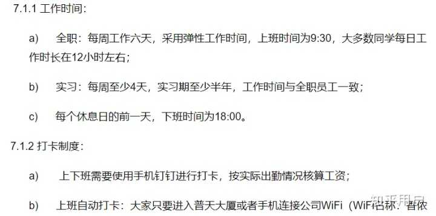

原文链接（可能被删帖）：https://www.zhihu.com/question/298711672/answer/1063287859

以下是原文：

------------

作为前不久刚被优化掉的香侬员工，不想被有些人污蔑为无脑黑，简单地对一些情况做一下说明。

1.是否存在压榨员工：

首先贴一下香侬员工日常行为守则

  

可以清楚地看到，虽然嘴上说是弹性工作制，但上下班打卡制度的存在，也就让这个说辞成为了没有加班费的意思。同时公司是鼓励员工996的，这一点上的员工关怀不说垃圾，至少也不是能打90分的水准。一个小细节，以前香侬是上午十点上班的，晚上十点后的打车费报销，后来管理层说由于甲方上班时间早，所以将上班时间提早到九点半，但打车费报销时间依旧是十点，很值得玩味。在最近的疫情期间，公司规定返京人员自行隔离14天之后需要到岗办公，如果选择远程办公则扣除30%的工资，且不说这是否合法，作为一个IT公司，本可以远程办公却以这种形式要求员工到岗，如果有员工感染，后果真是不堪设想。（听说昨天香侬因为疫情防范不合格被勒令整顿了，哭笑不得）

2.红杉是否撤资

这一点作为基层员工我们没有消息来源，但我们能够直观感受到香侬经营情况确实很差。从去年年底开始，香侬开始优化员工，不管是技术、产品、商务甚至是行政，都有被劝退的可能。到现在已经优化掉了将近20%的员工，其中确实包括公司前十号员工。其次，把年终奖发放日期一拖再拖改到4.10号，也让人无法对其财务情况放心。退一万步讲，即使红杉没有撤资，这种时候公司高层也没有跟员工进行过情况说明，大家不知道公司是否盈利，靠什么盈利，已经有一批有能力的员工主动辞职，剩下很多员工私下也觉得公司药丸。

3.管理是否混乱

香侬主要在平时工作中采取的是组长管理制，所以不同的组长会导致不同的工作状态和工作要求，遇上实力强劲的组长就能快速提升，遇上夸夸其谈的组长只能点满脱口秀天赋。但大多数组长由于刚毕业或者刚退学，并没有太多的管理经验，这样给予组长的权力其实不利于员工的管理。当然，公司创始人也没有什么管理经验，也跟有些回答所说的一样，不知道如何打造和运营完善的产品，像什么舆情监测、香侬文娱，烧了一大堆钱，然后也没卖出去，最后兢兢业业的底层员工还要为这些决策失误买单，被扣年终奖或者是背锅走人。当然什么组长跟组员恋爱啊，组长跟人力恋爱啊这种破事大家早已司空见惯，生活问题，都已经不是大事。

总而言之，香侬是一家典型的初创公司，也正朝向大多数初创公司的终点前进。如果你是个AI领域的学生，想来公司实习混一张Jiwei Li的推荐信然后出国读书，这里挺适合你的，其他的同学就最好别来了，不过最近应该也没有HC。