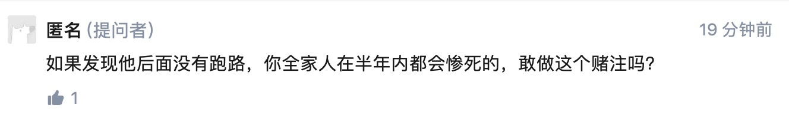

原文链接（可能被删帖）：https://www.zhihu.com/question/298711672/answer/1179396048

以下是原文：

--------------

庆幸终于出坑，在垃圾坑里呆久了，感觉自己都变垃圾了。

抄袭甲方idea，还copy甲方产品自己卖。这种公司也真是没谁了。也只有这帮人，这种公司才能干得出来吧。甲方据说还是曾经的北大校友，也选择息事宁人。

没有格局，没有胸怀，自己倒是挺把自己当根葱，也只有这种人才能说出“xn要是倒了，谁给你们发工资呢” 这种话吧。

真的是变着法儿地坑员工。哎哟喂，留下来的都什么人呐，相信我，在这种地方，只要别要脸，别要膝盖，你也可以被jw喜欢，荣升c\*o，走上人生巅峰。

之前连这个问题本身都被编辑了。讽刺的是，创建这个问题的人曾经也是xn员工，据说之前对jw人品极其不满，直接跟jw干起来了。 [@松若章](https://www.zhihu.com/people/898280f1efeb2128892080bd0e2a03ee)

哎，做人不能太ljw啊！

坑人，谎言，欺骗，双标，威胁，在xn真的都是日常操作。

* * *

在 [https://www.zhihu.com/question/388713840/answer/1161952251](https://www.zhihu.com/question/388713840/answer/1161952251) 里发现xn支持者的一个回答：

在xn什么感受自行体会吧。