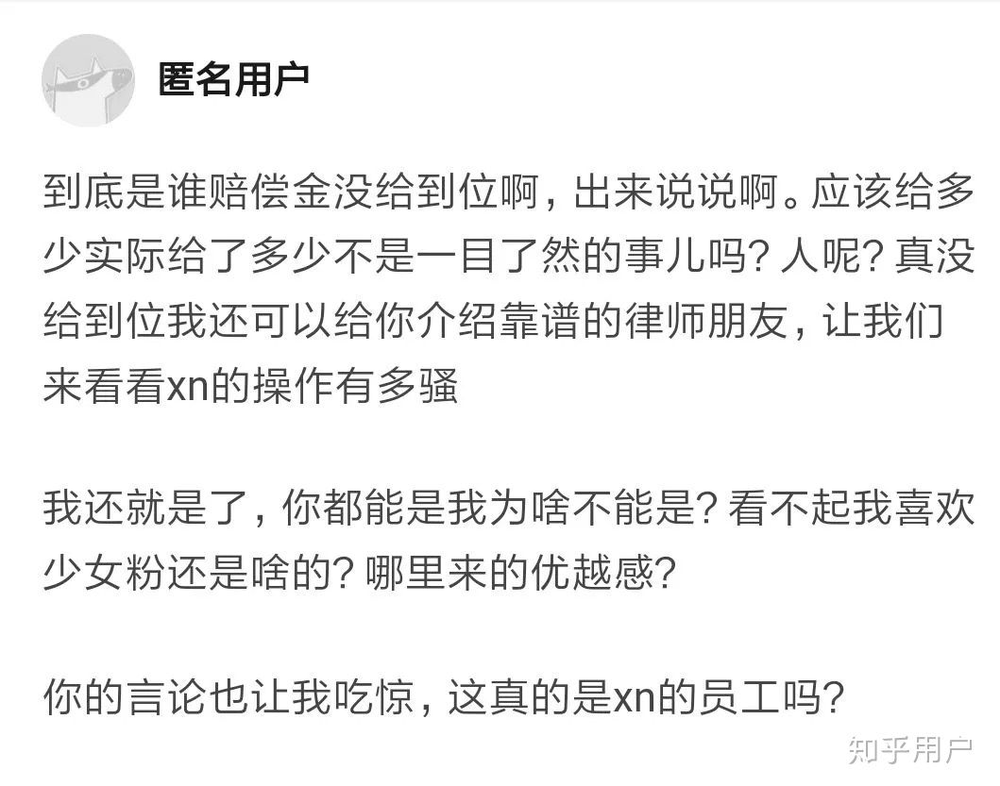

原文链接（可能被删帖）： https://www.zhihu.com/question/298711672/answer/1071718857

以下是原文：

---------

本意是使用一种夸张的颜色来嘲讽。没有考虑到可能会觉得我在给人贴标签，这里我道歉，并且已经修改原文，感谢这位同学的提醒

===========================

您要杠，我就再陪您倒数第二次吧！

处罚不等于处理确实啊，但是处罚不是处理的子集吗？处罚了就一定处理了这个有什么问题吗？

前十员工走的问题是我看错了，对不起。不过我刚才想了下前十号员工应该已经走了三个，两个是自己主动走的，另一个大家都知道。你知道你又不说是个什么意思呢？我也说知道走的原因啊，跟公司没什么关系啊。所以又能说明啥？

===========================

到底是谁赔偿金没给到位啊，出来说说啊。应该给多少实际给了多少不是一目了然的事儿吗？人呢？真没给到位我还可以介绍靠谱的律师朋友，让我们来看看xn的操作有多骚

===========================

员工手册有人违规了没处罚？你再看看到底处罚了没有？

两位离职的前十号员工，技术好我确实承认。但是正如你说的，你不知道一个走的原因。另一个走的人的原因也不是因为技术不到位，那这件事你又在说啥呢？

又不是就这一家公司。我一直在说的是我自己，而且上下文的假设条件都非常明确。你又在看不惯啥呢？

另外，你很值得我花时间在这上面啊！有的人工作做不完还要加班然后来喷被压榨了，有的人把活儿干完了还有时间来知乎上嘲讽呢！你气不气？

===========================

哈哈哈，如何定义合不合适。首先这是个私企，定义合适不是股东定义吗？难道还要开个全民投票？至于行为好不好，市场和投资人会教我们的各位股东做人，但应该不是你好吧。前十号里面一个是自己离职的，你也不知道人家的原因，另一个的原因，这个问题下面已经很多回答说这个问题了，是非自有公论

另外为了防止有些杠精说如果我被裁了合不合适啥的。我再重申一遍我的观点，赔偿给到位了不违法，我随便公司裁，爱裁不裁，又不是就这一家公司

另外的另外，如果你真想定义合不合适，那我给你指条明路。把公司搞大一点，多融基轮资，把某人的股份稀释到50%以下，然后用你的三寸不烂之舌说服别的投资人和股东，夺了某人的决策权。然后就可以裁谁的时候大家都一起投个票看看合不合适啦！你还可以把员工手册改成你喜欢的样子哦，封面也可以改成随便什么颜色呢！完美！我可真是个小天才～

===========================

说的好像现金流不健康你就不能要求补齐社保一样。你可真是个小机灵鬼～

===========================

跑完还被拽回来了

那就继续呗

1，现金流健康啊。意思是你看到一个人最近不吃肉改吃素了就说这个人要破产了？这是个什么逻辑？

2，我都把答案送到你嘴边了，我真是服了，无知的这么理直气壮也是可以的。vie结构下国内经营主体的股东一般都是自然人

3，kbqa用什么技术和他是否成熟有什么关系？一个稳定运行，创造了千万级营收的产品不叫稳定产品？它不是knowledge base还是不是qa？

4，目标混乱和架构变动和管理又有什么关系？这难道不是产品的问题吗？架构变动的原因不是因为之前的架构没有办法很好的服务现在的目标产品吗？难道是因为之前的架构不好管理人？

5，还是那句话，这本身就是一个商业行为，任何公司都有权利裁员，当然员工也有权利离职，只要赔偿按照法律来。当然目前为止我还没看到一个人跳出来说自己的赔偿金没拿够的，如果有，也希望你即使跳出来让我们看看xn的骚操作。所以我被开当然无所谓啊，又不是找不到工作了。再说前十号员工的事儿，那要你这么说如果只开后来的员工，可能又会有人说：“你看看那个谁谁谁，水平不行，干活又慢，工资又高，还经常滑水，为啥不开他就开新来的。不就是仗着来得早吗？”从公司角度以及大部分公司的人的角度当然是应该裁出现问题的人和不合适的人，这件事情上和他什么时候来是没有关系的，至少这才是最理性的做法

还有些别的点比如时间啥的，我从来没有帮时间洗过，我的原话是

> 再者虽说是9:30～20:30，中间还有两个半小时休息时间，中间的八个半小时，你只要不公然玩游戏或者在大屏幕上看视频，根本没人会管你好吧。

原本是说大家的时间是可以自己利用的，结果被说成强行洗工作时间不长，社会社会

最后的最后，再说三个点，理智的吃瓜群众可以好好思考思考，杠精的话请绕道

“契约”，“法律”，“人生目标”

xn违法的点我一点都不想洗，能改就改，不改的话看不下去的同学也可以一起举报，不想举报的同学也可以裁了xn

但是我所要说的重点是契约精神和人生目标。xn不违法的地方可能确实很多地方做的不够好，但是作为创业公司本身就有他的局限性，你当时选择来xn的时候其实默认的就是和xn达成了一个无形的契约，我知道xn是创业公司，xn可以有地方做的不够好，我也会包容，但是我希望和xn一起成长，在xn成长起来以后给我我应得的那一份。想一想你的人生目标是什么，如果你希望安安稳稳，找个非常轻松的工作，有大把的时间享受自己的生活。没有人会职责你，只是你应该去已经成熟的公司或者国企、政府。如果你想未来财富自由，眼看着一家公司从几十人变到上万人，那你就得容忍它在成长中遇到的各种各样的问题。如果你又想躺着，还又想财富自由，那我建议你找个好爹。如果你不满了，xn又是你唯一的选择，那我建议你沉下心来好好学点东西然后再跳走，而不是整天杞人忧天，如果你不满了，xn不是你唯一的选择，那及时换一个不是也挺好的吗？没有人会职责你的选择，只是希望你能够对自己的选择负责，希望你的选择能帮你早日实现你的人生目标

===========================

发现现在越来越多无脑黑子跳出来了

国内转海外是无稽之谈？怕是没学过vie架构？美元转人民币白白亏几百万？真是笑死人了，就说天眼查上的信息，红杉退出股东，股权转让给了三个自然人，红杉到头来转了一圈一点好处没占到，还亏一大笔钱然后乖乖把股权还回去了？你可真是个小天才

一边裁人一边招人叫心机？请你说个光裁人不招人的公司出来吧！

你们不要老想着搞个大新闻，那些西方记者比你们…拿错台词了，不好意思

装了逼就跑，真刺激！

===========================

瓜吃的有点撑，出来运动运动

大家喷的点来来回回就几个，一个一个说一下吧：

1、压榨员工

入职之前绝大部分人应该已经知道是上6天班了吧。虽然我对上六天班也很不爽，但是你选择入职的话其实表示你已经接受了这件事，你在某种程度上和公司达成了一种共识吧，如果不认同大可以不来，来都来了你tm又在bb啥呢？况且到现在为止，我还没有一次是被强制要求留下来的，干完活直接走，leader问起来的话把你做的又快又好的结果甩他脸上不好吗？再者虽说是9:30～20:30，中间还有两个半小时休息时间，中间的八个半小时，你只要不公然玩游戏或者在大屏幕上看视频，根本没人会管你好吧。有的人降低自己的效率磨磨唧唧卡着点把事情做完，感觉自己被公司压榨了；有些人干完活还复现了最新的论文；有些人干完活还顺便把ti看完了。那么问题来了，你又是那种呢？确实，上6天班让自己的时间会少了很多，但其实就我看来以大部分人的能力是能把上面交代下来的任务在规定时间做完以后还有多余的时间的。

2、 没有拿得出手的产品

本来之前就是个toB的公司，产品就不是给大部分个人用的，咋滴，你是B？公司最开始的KBQA至少就已经算是一个非常成熟的产品了。再说，要真有知道一定能赚很多很多钱的产品那创业的难度在哪里呢。有时候产品力、市场环境甚至运气都是产品是否能成功的必要条件，现在跑出来说你们公司没有拿得出手的产品这种话我也会说，随便去找一千个创业公司喷他们产品不行，老子的准确率也能到99.9%，完爆大部分模型，就问你怕不怕！在我看来创业就是从前面千千万万条路中找到一条能走得通的路，目前香侬虽然还没找到，但是香侬找路的能力或者找路的资本相对于大部分公司还是有一定优势的

3、管理混乱

首先管理的问题确实存在，但是我认为这大部分是管理能力的问题，而不是制度的问题。一个公司才100多个人，能有啥管理问题，还不是jw懒，顺便培养下面小朋友的能力。当然大家都没经验，所以肯定会存在各种各样的问题，但是也是因为扁平，所以问题其实是可以直接反应到最上面的，只要反应出来，信息是非常扁平的。很多情况我感觉是因为来公司的很多是职场的新人，遇到问题会选择在心里藏着，并没有找到很有效的沟通方法，再加上各个组的组长通常也是直男，所以并没有实现很好的双向沟通，这也造成了积怨。至于组织架构和产品策略的调整，两方面去看把，一方面是确实存在事先思考不够充分，出现了各种各样的问题；另一方面其实也是公司能够直面已经发现的问题，并及时去做调整。

4、人员优化问题

开公司其实就是做生意，人情事故当然会有影响，但是大部分情况其实是一个商业关系，大家各取所需。虽然很残酷，但是大部分情况是不得以而为止。再说，裁员不能完全代表公司经营情况，各大公司都有裁员，只能说这是策略问题，不能完全和现金流、经营情况划等号。至于赔偿是否到位，欢迎各位觉得受到了不公正对待的同学来说一说。这件事情上，我肯定站法理那一边。再说业界大佬和前10号员工的事情，这不是才说明公司铁面无私，管你什么背景都一视同仁吗（狗头）？

说完了主要的几个点再随便说说吧

红杉撤资了？破公司又没产品赚钱，又被撤资了，我们来看看能活多久吧

其实很多回答说出的问题确实都存在，但是问题在于我们需要从更多角度去看待这些问题。比如所谓的组长和人事谈恋爱这件事是事实，但是结果是人事同学现在已经离职，组长同学也收到了某些处罚。业界大佬离职这件事也是真的，不过个中原因其实公司已经有了官方的答复，在我看来也算合理。另外说一件小事情，公司对给你的期权其实是会花钱回购的，而且各个期权的条款也写的非常详细。大家去市面上看看有几家公司在这个阶段是会花现金去回购员工期权的，从侧面反应公司在某些角度还是比较厚道的。

关于加入创业公司。入职之前对于公司规模公司前景公司风险，大家作为成年人，心里还是要有点b数的？知道公司一定会成功上市还要你来上班干啥？高风险高回报，成年人要对自己的选择负责。

确实，最近公司的骚操作越来越多，之前习惯了公司节奏的人可能会不太适应，但是因为人多了，所以有时候会借鉴一些大公司的成熟的做法。好坏不说，只希望公司在作出决定之前也多和同学们沟通沟通。

感觉公司的直男癌有点严重...所以有些事情经常处理的没有那么细腻，包括对员工的心理状态的考虑

顺便，看一家公司怎么样，是不是多采采样，看破乎上的一群不是在职的就是离职的人的回答能看出点啥？

最后，多思考，思考自己想要的是什么；多沟通，告诉别人自己想要的是什么。有时候事情并没有那么难解决