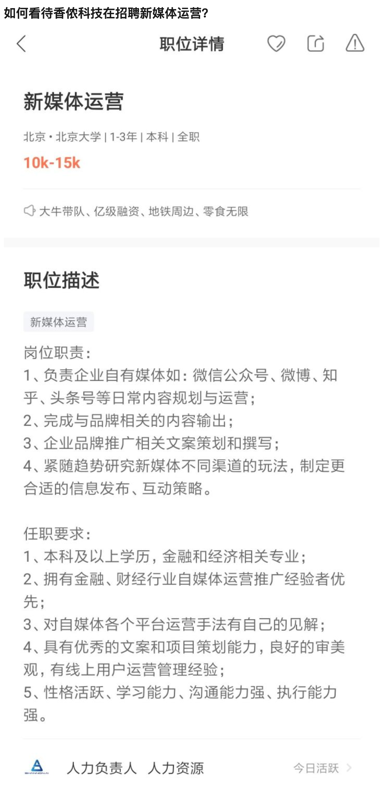
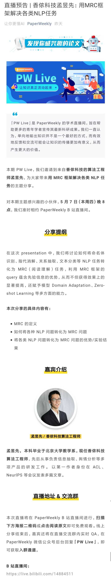
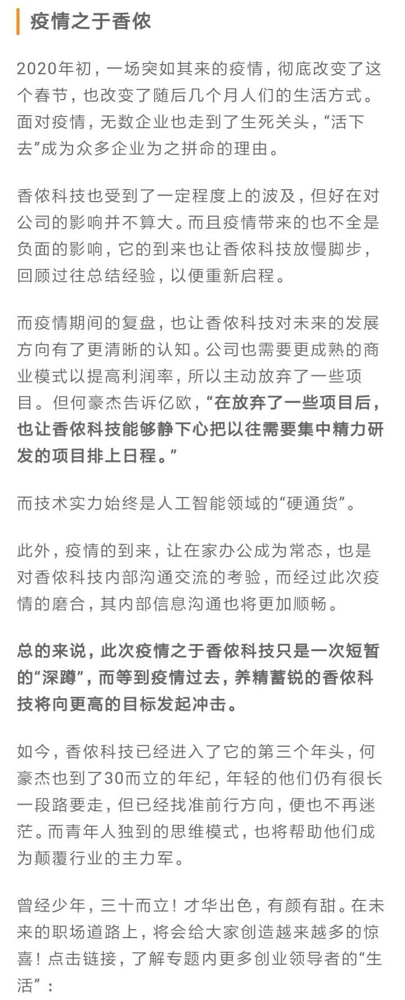

问题链接： https://www.zhihu.com/question/391289735

问题截图：

以下是回答合集

-----------------

以下问答已被删帖，原始链接丢失 :-( 

昨天预测了一下，ljw大概也知道自己不香了，所以开始给合伙人或所谓核心成员发专辑，果然今天看到了一个。

  

不知道说啥好，只希望小孟童鞋工作顺利，工资满意（现在还在香侬的人，你们的工资和奖金，是ljw克扣了我们的补偿，你们花的开心就好）

最后，只想再说一句：想去香侬工作的要留个心眼，想要和香侬合作的客户更要小心谨慎。

  

* * *

  

上班第一天，看到这篇报道，真是要恶心死我～

[https://www.iyiou.com/p/127512.html?share\_from=ec84c45LW7JV8IgkRClYTHOCsNROFL2Q5Zos2XQ3L6L9LhVwLVeyl3Fo62SZJ76iogv8d8Jnp\_bSEBJLlNvnrQn\_xNLAOGI2-Mp](https://link.zhihu.com/?target=https%3A//www.iyiou.com/p/127512.html%3Fshare_from%3Dec84c45LW7JV8IgkRClYTHOCsNROFL2Q5Zos2XQ3L6L9LhVwLVeyl3Fo62SZJ76iogv8d8Jnp_bSEBJLlNvnrQn_xNLAOGI2-Mp)

  

文中：**香侬科技**也受到了一定程度上的波及，但好在对公司的影响并不算大。

呵呵～这种鬼话都敢说，疫情期间裁员了多少人？给了多少补偿？所有的这一切合法吗？

香侬大概是招不到新媒体运营，于是找了一位“记者”童鞋吹捧。可是这位记者同学大概是没看知乎，不了解香侬，如果这位记者同学了解香侬，知乎过**香侬科技**，还这么吹捧，那是真“妓者”！

说说香侬产品之舆情，很垃圾的一款产品，没有任何值得拿出来说的亮点，谁用谁知道。

至于联合创始人hhj，接触不多，人品不详，但是一个91年的，本科学生物和硕士才开始学金融，这样的人负责产品？？？？？就算他是15年毕业吧，按他自己说17年底开始创业，2年多工作经验2面多创业经验，能做出啥产品。

莫非香侬策略是现在开始不旦旦神话ljw，开始神话联合创始人？？？下一期准备做谁的专辑？？？让我们准备好垃圾袋，尽情畅快呕吐～

  

  

* * *

LJW想多了吧，就发10-15K的工资给自己洗白，这个工作量很大，我更担心这位新媒体运营同学在香侬没呆多久会爆出更多的料。

让我们拭目以待～

* * *

我来给这个岗位的工（洗）作（白）量评估做个大致的说明：

a,公司ceo人品低劣只有几篇质量一般的paper，数量虽多奈何质量一般。

b,合伙人无真才实学，内部管理混乱，目标不清晰。

c,商业模式更无从说起，技术上没有革新，产品上没有创新。

d,Stanford的光环已逐渐暗淡，投资人也撤了股东方。

e,如何编制一个美好的未来，去吸引那些不了解情况的客户和求职者。

以上种种就不举例子了，小伙伴瓜吃的太多了。

建议ljw在文学院找一个，并给他相当多的股份，10-15k太少了，真是太为难人家了。

  

* * *

有香侬的小伙伴联系撤换ljw，这个想法不错，建议合伙人连同见微数据的领导，带领4壮汉，去公司抢夺公章，夺回大权。

这是一个很好的新闻素材。