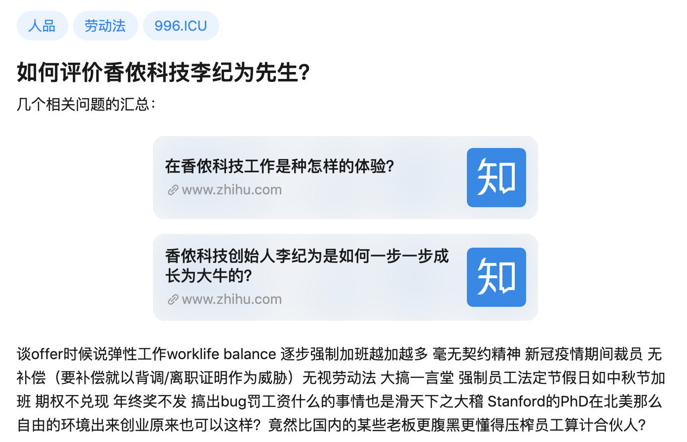

原问题链接（可能被删帖）：https://www.zhihu.com/question/379999648

以下是问题：

### 如何评价香侬科技李纪为先生？

几个相关问题的汇总：

[在香侬科技工作是种怎样的体验？](https://www.zhihu.com/question/298711672)   

[香侬科技创始人李纪为是如何一步一步成长为大牛的？](https://www.zhihu.com/question/299963736) 

谈offer时候说弹性工作worklife balance 逐步强制加班越加越多 毫无契约精神 新冠疫情期间裁员 无补偿（要补偿就以背调/离职证明作为威胁）无视劳动法 大搞一言堂 强制员工法定节假日如中秋节加班 期权不兑现 年终奖不发 搞出bug罚工资什么的事情也是滑天下之大稽 Stanford的PhD在北美那么自由的环境出来创业原来也可以这样？竟然比国内的某些老板更腹黑更懂得压榨员工算计合伙人？

以下是回答合集，因为回答较为简短，放在一起了：

--------------

原始链接：https://www.zhihu.com/question/379999648/answer/1171268724

从本科时候实名发公开信举报副院长性骚扰的热血青年[1]，成为博士毕业后压榨员工996的CEO[2]，不知道现在的他，面对年少的自己 ，是否会低下头，羞红脸[3]。

[1]: <a href="https://www.zhihu.com/question/299963736/answer/825362211" class="internal" data-za-detail-view-id="1043">https://www.zhihu.com/question/299963736/answer/825362211</a>

[2]: <a href="https://www.zhihu.com/question/298711672/answer/1080502533" class="internal" data-za-detail-view-id="1043">https://www.zhihu.com/question/298711672/answer/1080502533</a>

[3]: <a href="https://www.zhihu.com/question/51486998/answer/581424166" class="internal" data-za-detail-view-id="1043">https://www.zhihu.com/question/51486998/answer/581424166</a>

-----------------------------

原始链接：https://www.zhihu.com/question/379999648/answer/1132722400

很聪明很精致，3年博士很厉害，在对话领域论文很多，但是有多少影响力，大家心知肚明，

xn一出问题，就看到ljw准备去国外当老师，目前被疫情耽误，今年应该是出不去了。

-----------------

原始链接： https://www.zhihu.com/question/379999648/answer/1161397402

到现在为止 发酵了快2个月 还是没什么正面回复 有些事情越洗越显得脏 奉劝李纪为早点出来挨打认错吧 有点担当 还年轻 来日方长

创业失败不可怕 香侬也不是完全没机会自救 怕的是过程中暴露出的解决问题的方式与面对困难的态度 这些比成功失败带来的影响更长远 跑路找后路 以及花公司钱疯狂PR自己这些 真的有点丑 互联网上大家都不傻

--------------------

原始链接：https://www.zhihu.com/question/379999648/answer/1239348064

[@李纪为](https://www.zhihu.com/people/5e056432a4ff5e6120a5dc0c5d50afca) 请问李纪为如何看待香侬科技在疫情期间裁员，不给补偿，并且不按照工资进行缴纳社保，这种偷税漏税行为？

----------

原始链接： https://www.zhihu.com/question/379999648/answer/1179407852

非常精致，心机极深，变着法儿地坑员工。对投资人等高阶级层人比较舔，对同级或下级劳动者没有基本的尊重。

做人不能太李纪为啊！

------------------

原始链接：https://www.zhihu.com/question/379999648/answer/1179978827

先说结论：人品极差且善于伪装。

微信头上挂一个国旗，地区写美国旧金山。一个极其虚伪的伪君子。

再说说北大那事，问了几个朋友，基本肯定那女的是ljw的心上人，其心态基本就是求而不得就毁了，狭隘自私表现的淋漓尽致。

--------------

原始链接：https://www.zhihu.com/question/379999648/answer/1161397402

到现在为止 发酵了快2个月 还是没什么正面回复 有些事情越洗越显得脏 奉劝李纪为早点出来挨打认错吧 有点担当 还年轻 来日方长

创业失败不可怕 香侬也不是完全没机会自救 怕的是过程中暴露出的解决问题的方式与面对困难的态度 这些比成功失败带来的影响更长远 跑路找后路 以及花公司钱疯狂PR自己这些 真的有点丑 互联网上大家都不傻

----------------------------

原始链接：已丢失

谈offer时候说弹性工作worklife balance 逐步强制加班越加越多 毫无契约精神 新冠疫情期间裁员 无补偿（要补偿就以背调/离职证明作为威胁）无视劳动法 大搞一言堂 强制员工法定节假日如中秋节加班 期权不兑现 年终奖不发 搞出bug罚工资什么的事情也是滑天下之大稽 Stanford的PhD在北美那么自由的环境出来创业原来也可以这样？竟然比国内的某些老板更腹黑更懂得压榨员工算计合伙人？