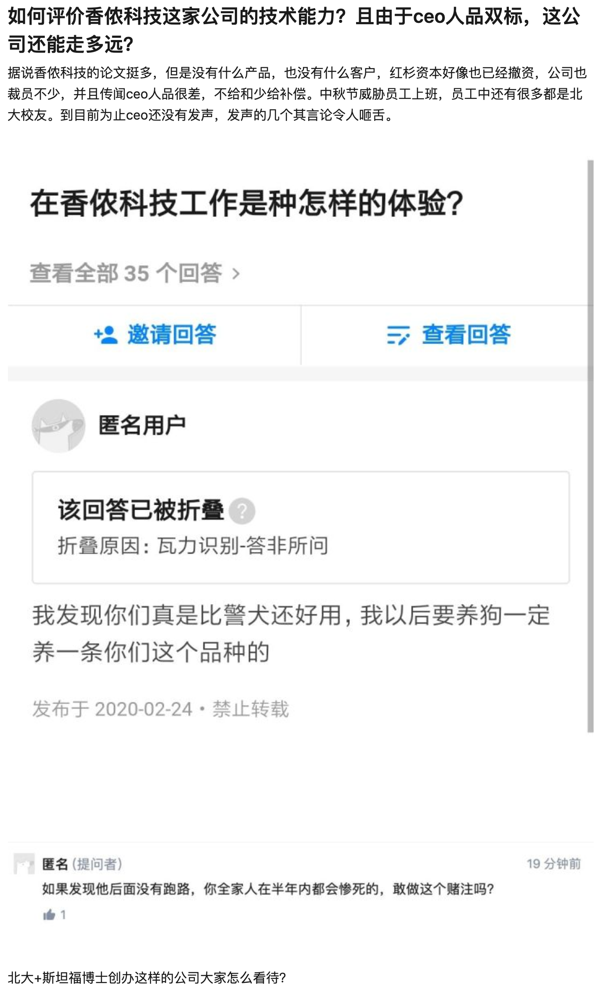

问题链接： https://www.zhihu.com/question/390603323

问题截图：

以下是回答合集：

------------

原始链接：https://www.zhihu.com/question/390603323/answer/1240826331

其它都是次要的，关键红杉资本已经撤资了，香侬没钱。

---------------

原始链接：https://www.zhihu.com/question/390603323/answer/1207324648

工程方面，靠谱的技术大佬都走了。

写论文算技术的话，jw就是天花板，这还是绝大多数人还达不到的。至于质量嘛，仁者见仁智者见智了。

能走多远，那要看社会对其品质的认可度了。