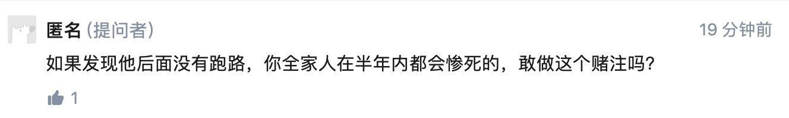
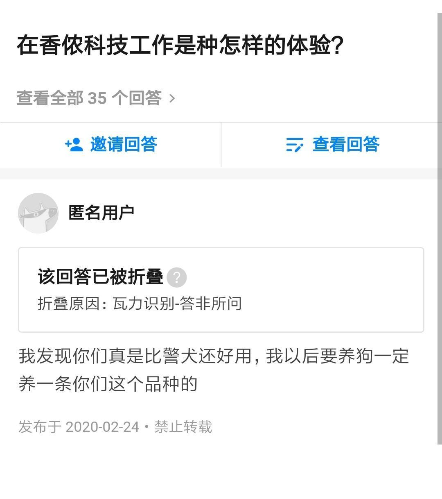
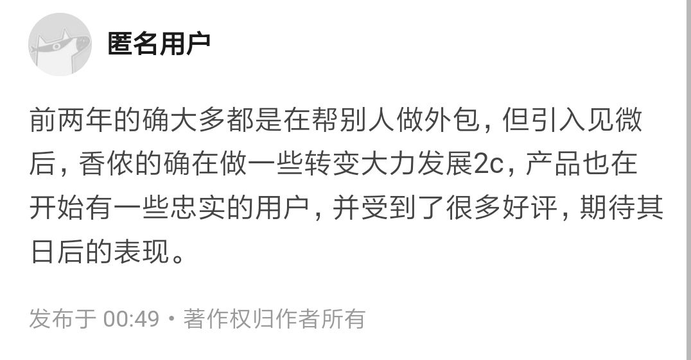
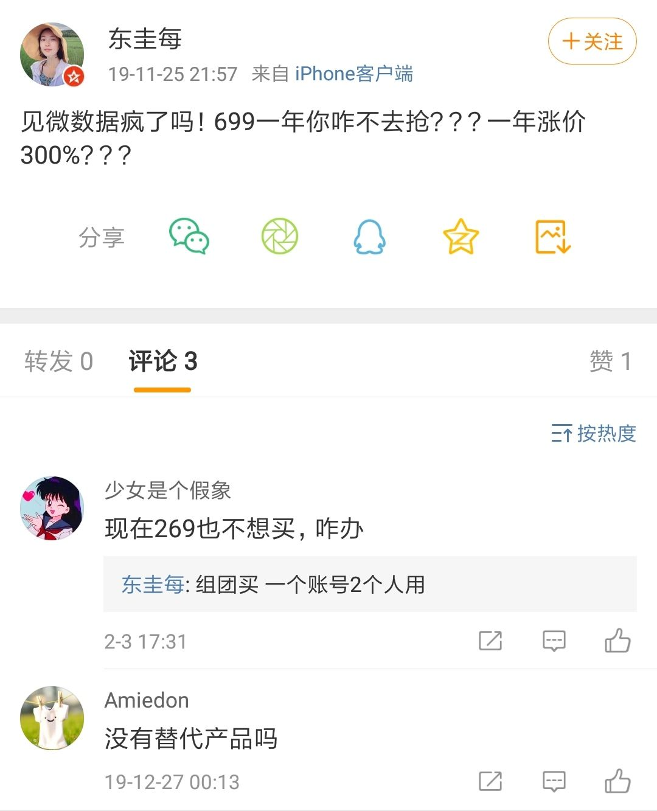

原文链接（可能被删帖）：https://www.zhihu.com/question/390638370/answer/1180458942

以下是原文：

-----------------

刚刚看到的图片，真是触目惊心。没想到ljw会用这样的人。想想真是可怕，所以客户们，你们敢用香侬的产品吗？

  

  

* * *

不要说客户了，连一个像样的产品都没有！！！

去年合并了见微数据公司后，有了一款产品。香侬的自研产品都很low。投资人也是郁闷，早知道投资见微数据了。

再说说ceo人品，拉了一帮北大的学弟去做廉价劳动力，说裁员就裁员，以背调做威胁，不给或者少给补偿。还抄袭甲方的创意，奈何甲方也是个北大的。哎～

这就是**香侬科技**ceo，做人不能太ljw！！！

另外撤资是否属实，我不能确认，但可以确认的是到目前为止，ljw没有公开对此反驳过，在内部会议谈到此事也失去以往的意气风发。

个人感觉香侬在下半年会黄。

有个学姐告诉我，红杉内部并不看好香侬，近期ceo一系列人品事件让大家更灰心，可以肯定的是红杉不会再给香侬一分钱。

大家趁早撤吧，别等到后面被优化，被恶心，没补偿。

同时，据国外朋友说，ljw也在积极筹备一旦香侬倒闭，他会去国外某大学，当然了国内的大学他也在积极的投简历。老板都在投简历～不说了，去投简历了。吼吼～

* * *

  

  

针对此人的话，我说几点。

第一：前两年并不是做外包，而是在伟大领袖李博士的带领下闭门造车，将他的宏伟理论转化成产品，最后发现卖不出去，当然投资人也发现上当了，于是撤资。后来的事情大家都知道，李博士人品大暴露，并有了著名的那句话“做人别太ljw”。

第二：其实见微就是活不下去了才来香侬的，说白了见微也是快倒闭的公司，并且原见微的ceo并没有来。

第三：见微的客户中没有多少是付费用户，大部分都是用的免费版本，因为如果收费大家可能不会去用，或者组团买。不久前见微在香侬的唆使下，强行提价，已经引起了很多老用户的不满，最后放弃了。

  

第四：见微其实没有很高技术门槛，只要同花顺，雪球，万得等想做，分分钟可以灭了见微，见微现在也有荣大的二郎神是最可怕的竞争对手。

第五：原本toB没有做好，寄希望引入一家也快倒闭的公司就能把toC做好？这是什么逻辑？弱弱联合吗？

结论：各位看官不用期待日后表现，香侬是为了应付投资人情况下并购了也快倒闭的见微然而香侬和见微就是两个临时的凑拢班子，同床异梦，分手是迟早的。

  

* * *

再聊聊CEO，为什么知乎上这么多人指责他，他却不发声？因为他根本不在乎。

他不在乎客户、他不在乎投资人、他也不在乎合伙人、当然他更不会在乎员工。

事实上，他的根据地根本不在国内，他回国创业就是为了试试看，他自己可能都没想到融资这么顺利。因此他也根本就没做好能把企业做好的准备，这个准备包括：合伙人选择、商业模式、市场调研等等，所以香侬失败很正常。

本质上来说，LJW就是一个不会对中国的客户们负责、也不会对中国的员工们负责的、没有担当且低能外黄内白的创业者。

如果不是疫情，可能他早就把公司卖了然后去他微信头像中的旧金山。