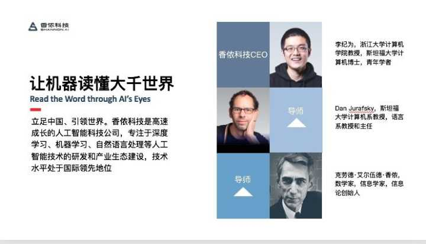
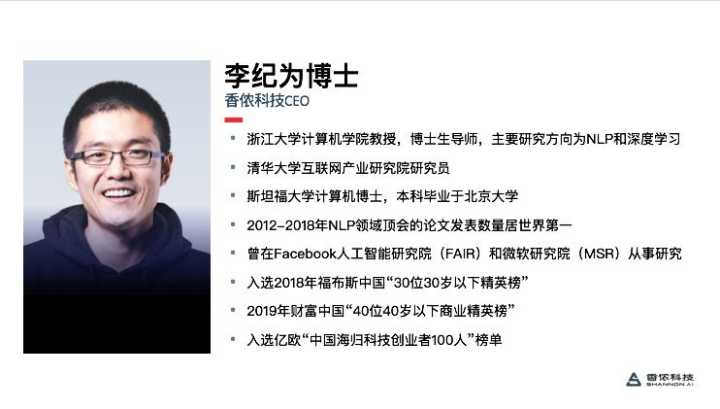

问题链接（可能已被删帖）： https://www.zhihu.com/question/388659336

以下是问题描述：

香侬科技最近事情比较多 目前创始人又要跑路 大家怎么看呢 创业遇到困境就转行当老师回归舒适区 这种留退路的做法 是否会成为以后学者创业的不确定性因素？

以下是回答合集：

-----------

原始链接：已丢失

去浙大不仅仅是跑路这么简单吧。

浙大计算机学院很多老师都有自己的公司，似乎教授开公司在浙大计算机学院都成风气了，而且这风气比很多同档次高校都严重（要不然张志华当年也不会离开浙大先去上交后去北大了）。

去浙大申个青千可以招一大批廉价硕博，然后挂个浙大的牌子开公司，名正言顺的把硕博弄到公司里低薪干活（浙大计算机博士毕业学院层面最低标准2篇CCF B就可以了，不知道现在提高了没有）。

别的老师我可能会怀疑这么做，但是ljw去了这么做我丝毫不感到诧异，毕竟有前科了，只不过在互联网业界招人由于各种因素没法开一个月2000多点的工资而已。

——————————————————————————————————

话说哪位去百度词条编辑一下，别总写好的方面啊，多爆爆黑事，避免后人入坑啊。

[李纪为\_百度百科bkso.baidu.com]([https://bkso.baidu.com/item/%E6%9D%8E%E7%BA%AA%E4%B8%BA/22486461](https://bkso.baidu.com/item/李纪为/22486461))

------------------------------------

原始链接：已丢失

这... 只能说真的不太好吧 不方便评论 也不喜欢评判别人的行为 事情主贴写了很多 有些事情也是定局 希望jiwei能够尽力弥补 这时候去高校就不只是创业失败一个问题了

ps 莫名其妙被xn人在评论区辱骂一番 真是无语 举报+吐槽下员工素质问题

-------------------------

原始链接：已丢失

这哥们不去混金融圈子或者从政可惜了 操纵各方面资源的能力是真的强 也可惜了AI圈子和学术圈子 本来是净土

创业回去当老师没啥问题 但是在香侬因为个人管理问题闹成一锅粥的时候撤出 实在不太厚道 对跟随他的员工以及投资人都非常不负责 这种找退路的行为应该要坚决杜绝 不然以后学者还怎么创业 谁还敢投资 典型老鼠屎 害了所有后来人

也希望浙大能够多做做背调 擦亮眼睛 人品比能力重要 何况jiwei li的paper一直可复现性非常差 不排除造假或者熟人审稿的可能性 做人有这么高调 以后出了事对浙大也是巨大损失

-------------------------

原始链接：已丢失

泻药

jiwei的paper确实不少 但是学术水平我想资深NLPer也都比较了解 中等偏上吧 离所谓大佬有差距

我比较担心的是他的research taste（小而新的问题 简单搭积木的solution 略微不求甚解短平快的工作方式）会把国内唯数量论的学术风气 带向更不好的地方

先前已经因为不懂商业创业波折一次了 可能先去大厂了解下真实NLP业务再回高校是更好的选择 也能找到更好的研究问题 别再浪费天赋继续灌水了

-------------

原始链接：已丢失

见下图：我们香侬李博士李教授这开（付）挂（费）的（玩）人（家）生，就问你们服不服。

